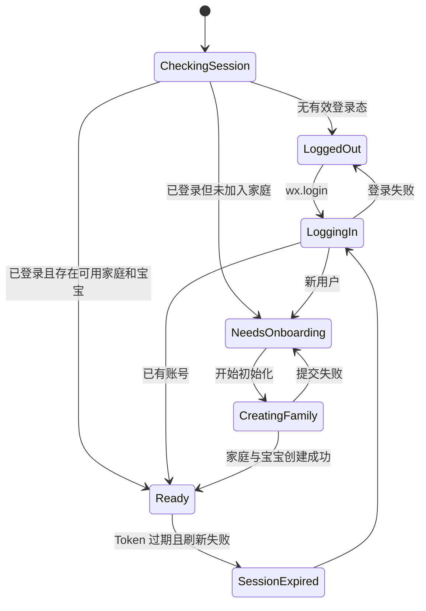
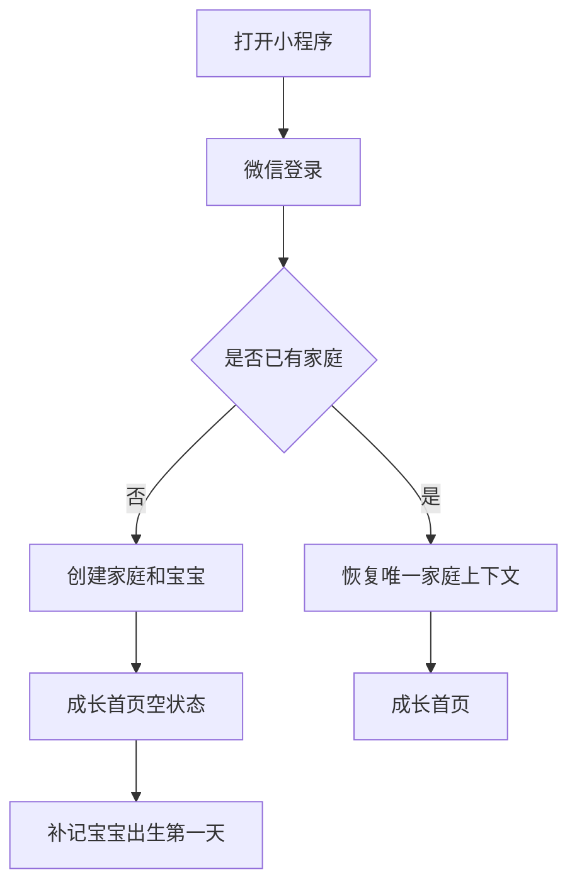
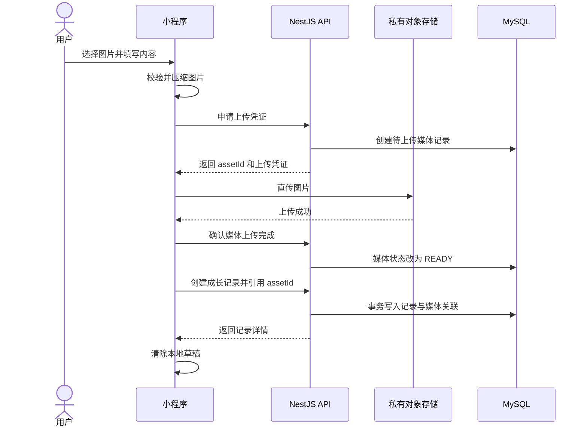

# 阶段一信息架构

## 1. 设计原则

阶段一以“尽快开始记录”为唯一主线，不提前增加里程碑、语音、导出或 AI 页面。

信息架构遵守以下原则：

- 首次进入只做必要决策，不要求手机号、真实姓名或完整个人资料。
- 首页直接呈现宝宝和时间线，不增加资讯流或运营内容。
- 新增记录在任意核心页面保持一键可达。
- 发生时间与创建时间分离，允许补录宝宝出生第一天以来的内容。
- 前端隐藏操作只用于改善体验，最终权限必须由后端校验。
- 使用 wot-design-uni 官方组件承载按钮、输入、弹窗、状态和加载反馈。
- 所有颜色通过 CSS 变量定义，首版即支持暗黑模式。

## 2. 阶段一用户状态



补充状态：

- 用户已加入家庭但宝宝已被禁用：进入不可用说明页，不自动创建新宝宝。
- 用户曾加入家庭但成员关系已被移除，且没有其他可用家庭：进入不可用说明页，不允许误创建新家庭。
- 数据模型为后续多家庭预留，但阶段一产品流程只支持一个可用家庭和一个可用宝宝；若服务端发现多个可用家庭，不自行猜测“最近家庭”，进入不可用说明页并记录异常，家庭切换在阶段二实现。
- 阶段一实际使用入口只开放首位创建者；父母和亲属角色先完成数据结构、权限策略与自动化测试，邀请加入流程在阶段二开放。

## 3. 导航结构

阶段一使用两个底部导航项和一个全局新增入口：

```text
底部导航
├── 成长
│   ├── 宝宝摘要
│   ├── 月份筛选
│   ├── 类型筛选
│   └── 成长时间线
├── 我的
│   ├── 当前用户
│   ├── 宝宝档案
│   ├── 当前家庭
│   └── 项目与隐私说明
└── 全局悬浮按钮
    └── 新增成长记录
```

里程碑将在阶段二成为第三个底部导航项；阶段一不放置不可用占位入口。

## 4. 页面路由

| 路由 | 页面 | 类型 | 权限 | 阶段一职责 |
|---|---|---|---|---|
| `pages/launch/index` | 启动页 | 普通页 | 无 | 恢复登录态、加载应用上下文、决定跳转 |
| `pages/onboarding/index` | 首次初始化 | 普通页 | 已登录 | 一次提交创建家庭和宝宝 |
| `pages/growth/index` | 成长首页 | Tab 页 | 家庭成员 | 宝宝摘要、筛选、时间线、新增入口 |
| `pages/mine/index` | 我的 | Tab 页 | 已登录 | 当前身份、家庭和宝宝入口 |
| `pages/record/edit` | 新增/编辑记录 | 普通页 | 家庭成员 | 创建、补录或编辑记录 |
| `pages/record/detail` | 记录详情 | 普通页 | 家庭成员 | 展示完整内容与有权限的操作 |
| `pages/baby/profile` | 宝宝档案 | 普通页 | 家庭成员 | 查看档案；管理员和父母可编辑 |
| `pages/family/profile` | 家庭信息 | 普通页 | 家庭成员 | 查看当前家庭与自身角色 |
| `pages/common/unavailable` | 不可用说明 | 普通页 | 已登录 | 处理成员被移除、宝宝停用等状态 |

## 5. 页面详细定义

### 5.1 启动页

#### 页面目标

在不闪烁业务页面的前提下，完成登录恢复和家庭上下文判断。

#### 页面内容

- 品牌标识或简洁加载状态
- `wd-loading` 加载组件
- 超时后的重试按钮
- 非技术化错误说明

#### 页面逻辑

1. 读取本地 Access Token 和 Refresh Token。
2. 没有可用登录态时进入前端本地 `LOGIN` 状态，执行 `wx.login` 并调用微信登录接口；`LOGIN` 不是服务端 `nextAction`。
3. Access Token 可用时调用启动上下文接口；Access Token 过期时只允许触发一次刷新请求。
4. 刷新失败时清理本地登录态，重新进入前端本地 `LOGIN` 状态。
5. 登录或启动上下文接口成功后，根据服务端返回的 `nextAction` 跳转：
   - `ONBOARDING`：首次初始化
   - `ENTER_APP`：成长首页
   - `UNAVAILABLE`：不可用说明
6. 启动页不直接读取 OpenID，也不在本地保存 OpenID。

#### 异常状态

- 微信登录失败：展示重试，不创建匿名业务账号。
- 服务端不可用：展示“暂时无法连接”，保留本地草稿。
- 刷新 Token 失效：清理登录态后重新执行微信登录。

### 5.2 首次初始化页

#### 页面目标

让首位用户一次完成家庭和宝宝初始化，避免出现只创建了一半的中间状态。

#### 字段

| 字段 | 必填 | 规则 |
|---|---:|---|
| 家庭名称 | 是 | 默认“宝宝的家”，2～30 字 |
| 宝宝昵称 | 是 | 1～20 字 |
| 出生日期 | 是 | 不得晚于今天 |
| 出生时间 | 否 | 精确到分钟 |
| 性别 | 否 | 男、女、暂不填写 |

#### 提交规则

- 使用 `wd-form`、`wd-input`、`wd-datetime-picker`、`wd-radio-group`。
- 客户端先做即时校验，服务端再次校验。
- 服务端在一个数据库事务中创建：家庭、管理员成员关系、宝宝。
- 使用客户端请求 ID 保证重复提交幂等。
- 提交成功前不可进入成长首页。

### 5.3 成长首页

#### 页面目标

打开后立即看到宝宝当前阶段和最近成长内容。

#### 页面结构

```text
成长首页
├── 宝宝摘要卡
│   ├── 头像
│   ├── 昵称
│   ├── 出生第 N 天 / N 月龄
│   └── 编辑档案入口
├── 筛选栏
│   ├── 月份
│   └── 记录类型
├── 时间线
│   └── 成长记录卡片列表
└── 新增记录悬浮按钮
```

#### 宝宝摘要规则

- 未满一个日历月时显示“出生第 N 天”；`N = 当前本地日期与出生日期的自然日差 + 1`，出生当天为第 1 天。
- 满一个日历月后显示完整月龄，按日历月计算，不使用“天数除以 30”；目标月份没有对应日期时以该月最后一天作为满月节点。
- 详情页始终可以查看按上述自然日口径计算的精确天数。
- 时间计算以宝宝出生地约定时区为准；阶段一固定为 `Asia/Shanghai`。
- 宝宝摘要卡最多展示两行主信息，避免挤占首屏。

#### 时间线规则

- 按 `occurredAt DESC, id DESC` 排序。
- 使用游标分页，不使用页码分页。
- 默认每次返回 20 条。
- 切换月份或类型时重置游标。
- 下拉刷新保留当前筛选条件。
- 滚动加载时禁止并发请求下一页。

#### 卡片信息层级

1. 发生日期、具体时间、宝宝当时年龄。
2. 第一张图片或文字摘要。
3. 记录类型、创建者昵称。
4. “更多”操作入口。

卡片控制在 3～4 行；编辑和删除放入 `wd-action-sheet`。

#### 页面状态

- 首次加载：`wd-skeleton`。
- 空状态：引导“补记宝宝出生的第一天”。
- 筛选无结果：展示清除筛选入口。
- 加载更多失败：保留现有列表，列表底部重试。
- 权限失效：退出当前家庭上下文。

### 5.4 新增/编辑记录页

#### 页面目标

在 30 秒内完成一条成长记录，并允许补录历史内容。

#### 字段

| 字段 | 必填 | 规则 |
|---|---:|---|
| 记录类型 | 是 | 日常 `DAILY`、第一次 `FIRST`、家庭陪伴 `FAMILY`、其他 `OTHER` |
| 正文 | 条件必填 | 最多 1000 个字符；与图片至少有一项 |
| 图片 | 条件必填 | 最多 9 张；与正文至少有一项 |
| 发生时间 | 是 | 默认当前时间，可修改 |

#### 图片处理流程


#### 交互规则

- 图片上传和记录提交分离，记录只引用已完成的媒体资源。
- 微信小程序端使用 `uni.uploadFile` 发起 `POST multipart/form-data` 直传；服务端返回的表单字段作为不透明参数透传给对象存储，不在客户端拼接签名。
- 显示每张图片的上传进度和失败状态。
- 单图失败允许重试或移除，不重复上传已成功图片；移除已完成上传但尚未绑定记录的图片时，同时请求服务端清理该媒体资源。
- 保存按钮在正文和图片均为空时禁用。
- 提交期间禁止重复点击。
- 编辑记录使用乐观锁版本号，避免覆盖其他家庭成员的修改。

#### 时间校验

- 宝宝填写了出生时间时，记录不得早于换算后的准确出生时刻。
- 宝宝未填写出生时间时，只比较宝宝时区下的本地日期；出生当天任意时间均允许记录。
- 不得晚于服务端当前时间 5 分钟以上。
- 前端提示只改善体验，服务端规则为最终依据。

#### 草稿规则

- 正文、记录类型、发生时间和草稿图片持久路径保存为本地草稿。
- 压缩后的临时图片必须通过微信小程序 `FileSystemManager` 保存到用户数据目录的独立草稿目录，不能直接持久化 `chooseImage` 或压缩接口返回的临时路径。
- 页面意外退出、网络错误、登录刷新或小程序重启后均可以恢复。
- 草稿按 `familyId + babyId + draftId` 隔离。
- 成功创建记录、用户主动删除草稿或从草稿移除单张图片后，同时清除对应的草稿索引和持久图片文件；已上传但未绑定记录的资源还要调用服务端清理接口。
- 草稿目录设置总容量上限并在写入前检查剩余空间；持久化图片失败时至少保留文字字段，并提示用户重新选择图片。
- 恢复超过 24 小时的草稿时，服务端媒体资源可能已进入清理流程；创建记录返回 `ASSET_NOT_READY` 时，客户端使用仍保存的本地草稿文件重新申请凭证并上传。
- 切换家庭时不得展示其他家庭的草稿。

### 5.5 记录详情页

#### 展示内容

- 发生时间和宝宝当时年龄
- 完整正文
- 图片列表与预览
- 创建者和创建时间
- 最后编辑时间
- 当前用户可执行的操作

#### 权限操作

- 管理员：编辑、删除任意记录。
- 父母：编辑任意记录；删除自己的记录。
- 亲属：编辑和删除自己的记录。
- 无权操作时不展示按钮；后端仍必须拒绝伪造请求。

### 5.6 我的

阶段一只展示必要入口：

- 当前微信身份的应用昵称与头像占位
- 当前家庭名称和自身角色
- 宝宝档案入口
- 隐私与数据说明
- 当前版本信息
- 退出登录

家庭成员管理、数据导出和回收站在阶段二加入。

### 5.7 宝宝档案

#### 查看权限

所有有效家庭成员均可查看。

#### 编辑权限

- 管理员和父母可以编辑。
- 亲属只读。

#### 可编辑字段

- 昵称
- 出生日期
- 出生时间
- 性别
- 简介

修改出生时间时，如果已有记录早于新的出生时间，服务端返回冲突并要求先处理相关记录。

### 5.8 家庭信息

- 所有有效家庭成员可查看家庭名称、自身角色和加入时间。
- 阶段一不展示成员列表、邀请码或加入入口。
- `ADMIN` 可修改家庭名称；其他角色只读。
- 页面明确提示“家庭邀请将在后续版本开放”，但不放置不可点击按钮。

### 5.9 不可用说明

以下状态进入该页面：

- 用户曾经加入家庭，但成员关系已被移除。
- 当前家庭已停用，或家庭内没有可用宝宝。
- 阶段一检测到多个可用家庭或多个可用宝宝，无法安全确定当前上下文。

页面仅展示状态说明、重试和退出登录。它不自动创建家庭，也不泄露已无权访问的家庭或宝宝资料。

## 6. 核心流程

### 6.1 新用户开始记录



### 6.2 创建图文记录



## 7. 前端状态划分

Pinia 只保存跨页面、可恢复的业务状态：

| Store | 职责 | 是否持久化 |
|---|---|---:|
| `authStore` | Token 状态、当前用户、刷新锁 | Token 持久化；用户可重取 |
| `appStore` | 启动状态、主题、版本信息 | 主题持久化 |
| `familyStore` | 当前家庭、角色、可用家庭列表 | 不持久化；由启动上下文恢复 |
| `babyStore` | 当前宝宝摘要 | 不持久化 |
| `timelineStore` | 当前筛选、列表和游标 | 仅筛选条件持久化 |
| `draftStore` | 成长记录草稿索引 | 持久化 |

页面内部加载态、弹窗开关和表单校验不进入全局 Store。

## 8. API 依赖映射

| 页面 | 主要接口 |
|---|---|
| 启动页 | 微信登录、刷新 Token、启动上下文 |
| 首次初始化 | 原子创建家庭与宝宝 |
| 成长首页 | 宝宝摘要、成长记录游标列表、批量媒体访问地址 |
| 新增记录 | 上传凭证、确认上传、创建记录 |
| 编辑记录 | 记录详情、上传凭证、更新记录 |
| 记录详情 | 记录详情、批量媒体访问地址、删除记录 |
| 我的 | 当前用户、当前家庭上下文、退出登录 |
| 宝宝档案 | 宝宝详情、更新宝宝 |

接口的完整路径、权限和错误码见《阶段一接口清单》。

## 9. 阶段一不做

- 手机号绑定
- 家庭邀请 UI
- 里程碑
- 语音和视频
- 评论、点赞或公开分享
- 育儿内容或健康建议
- 数据导出和回收站 UI
- AI 总结
- H5 和 App 端验收

上述功能不得以隐藏入口、未完成按钮或空白页面提前出现。

## 10. 信息架构验收

- 新用户可以从启动页连续完成登录、初始化和首条记录。
- 任意核心页面最多一次操作即可进入新增记录。
- 用户可以补录宝宝出生后的历史记录。
- 时间线的加载、空、失败、无权限状态均有明确反馈。
- 网络失败不会清空正在编辑的内容。
- 小程序重启后可以恢复文字草稿和仍在本地配额内的草稿图片。
- 页面路由不依赖手机号或公开用户资料。
- 页面权限表现与后端权限矩阵一致。
- 所有核心交互可由 wot-design-uni 官方组件完成。
