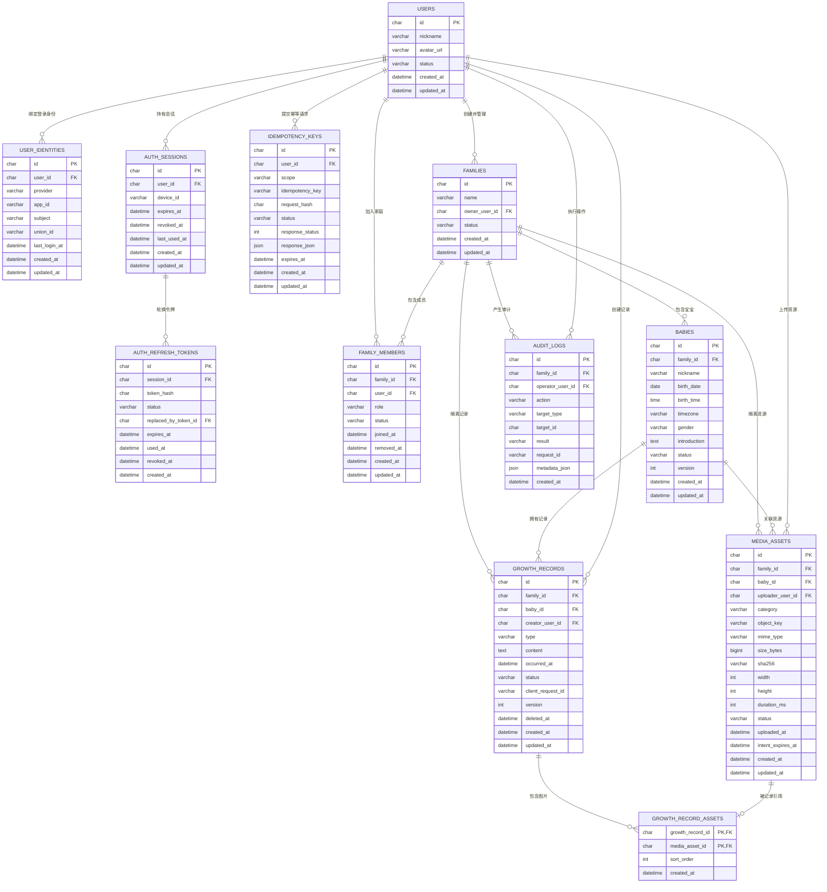

# 阶段一数据库 ER 设计

## 1. 设计目标

阶段一的数据模型需要同时满足：

- 微信 OpenID 可稳定映射到应用内部用户，业务表不直接依赖 OpenID。
- 所有宝宝、成长记录和图片均归属于家庭，避免跨家庭越权访问。
- 支持成长记录补录、编辑、软删除和时间线稳定翻页。
- 支持图片直传对象存储，不让 NestJS 服务转发大文件。
- 为后续家庭邀请、里程碑、语音、回收站和数据导出预留扩展空间，但不提前实现对应业务表。

## 2. 数据库约定

| 项目 | 约定 |
| --- | --- |
| 数据库 | MySQL 8.x |
| ORM | Prisma |
| 主键 | ULID，数据库类型 `CHAR(26)` |
| 时间字段 | `DATETIME(3)`，统一以 UTC 写入 |
| API 时间格式 | ISO 8601，例如 `2026-08-06T08:30:00.000Z` |
| 展示时区 | 宝宝时区，阶段一默认 `Asia/Shanghai` |
| 字符集 | `utf8mb4` |
| 删除策略 | 核心业务数据软删除；身份关系和审计日志不做级联物理删除 |
| 并发控制 | 可编辑聚合根使用递增 `version` 乐观锁 |

> 前端“本地草稿”只保存在设备本地，不进入服务端数据库。

## 3. ER 图



## 4. 表结构与关键约束

### 4.1 `users`：应用用户

保存与登录渠道无关的内部用户。业务表只引用 `users.id`。

| 字段 | 类型 | 必填 | 说明 |
| --- | --- | --- | --- |
| `id` | `CHAR(26)` | 是 | ULID |
| `nickname` | `VARCHAR(64)` | 否 | 微信昵称不是可信身份信息，允许为空或后续修改 |
| `avatar_url` | `VARCHAR(512)` | 否 | 头像地址 |
| `status` | `VARCHAR(16)` | 是 | `ACTIVE`、`DISABLED` |
| `created_at` | `DATETIME(3)` | 是 | 创建时间 |
| `updated_at` | `DATETIME(3)` | 是 | 更新时间 |

索引与约束：

- 主键：`id`。
- 索引：`(status, created_at)`。

### 4.2 `user_identities`：第三方身份映射

微信登录的稳定性由这张表保证。阶段一 `provider` 固定为 `WECHAT_MINI_PROGRAM`，`subject` 保存 OpenID。

| 字段 | 类型 | 必填 | 说明 |
| --- | --- | --- | --- |
| `id` | `CHAR(26)` | 是 | ULID |
| `user_id` | `CHAR(26)` | 是 | 对应内部用户 |
| `provider` | `VARCHAR(32)` | 是 | 身份提供方 |
| `app_id` | `VARCHAR(64)` | 是 | 微信小程序 AppID |
| `subject` | `VARCHAR(128)` | 是 | 当前 AppID 下的 OpenID |
| `union_id` | `VARCHAR(128)` | 否 | 微信返回时保存，阶段一不依赖它登录 |
| `last_login_at` | `DATETIME(3)` | 是 | 最近登录时间 |
| `created_at` | `DATETIME(3)` | 是 | 创建时间 |
| `updated_at` | `DATETIME(3)` | 是 | 更新时间 |

索引与约束：

- 唯一索引：`(provider, app_id, subject)`，保证同一微信身份只映射一个用户。
- 普通索引：`user_id`、`(provider, union_id)`。
- 不保存 `wx.login` 临时 `code`；`session_key` 如业务暂不需要解密能力则不落库。
- OpenID 不返回给前端，也不写入业务日志。

### 4.3 `auth_sessions`：设备会话

用于聚合一次微信登录产生的设备会话。Access Token 的 `sid` Claim 保存该表 `id`，主动退出和复用检测均按会话整体撤销。

| 字段 | 类型 | 必填 | 说明 |
| --- | --- | --- | --- |
| `id` | `CHAR(26)` | 是 | 会话 ID |
| `user_id` | `CHAR(26)` | 是 | 用户 ID |
| `device_id` | `VARCHAR(128)` | 否 | 客户端随机生成并持久化的安装标识，不读取硬件指纹 |
| `expires_at` | `DATETIME(3)` | 是 | 会话绝对过期时间，阶段一为登录后 30 天，轮换不延长 |
| `revoked_at` | `DATETIME(3)` | 否 | 退出或检测到复用时撤销 |
| `last_used_at` | `DATETIME(3)` | 否 | 最近刷新时间 |
| `created_at` | `DATETIME(3)` | 是 | 创建时间 |
| `updated_at` | `DATETIME(3)` | 是 | 更新时间 |

索引与约束：

- 普通索引：`(user_id, revoked_at, expires_at)`。
- `device_id` 只用于会话展示、限流和风险判断，不作为身份凭据。
- 会话过期或撤销后，该会话下所有 Refresh Token 均不可再使用。

### 4.4 `auth_refresh_tokens`：Refresh Token 轮换链

每次登录和刷新都创建独立令牌记录，保证服务端能够区分“随机无效 Token”和“已经轮换过的旧 Token 被复用”。

| 字段 | 类型 | 必填 | 说明 |
| --- | --- | --- | --- |
| `id` | `CHAR(26)` | 是 | Token ID，同时作为 Refresh Token 中不透明的 `tokenId` |
| `session_id` | `CHAR(26)` | 是 | 所属设备会话 |
| `token_hash` | `CHAR(64)` | 是 | 随机 Secret 的 HMAC-SHA-256，不保存明文 Token，HMAC 密钥由服务端密钥管理 |
| `status` | `VARCHAR(16)` | 是 | `ACTIVE`、`ROTATED`、`REVOKED` |
| `replaced_by_token_id` | `CHAR(26)` | 否 | 轮换后生成的新 Token ID |
| `expires_at` | `DATETIME(3)` | 是 | 不得晚于会话绝对过期时间 |
| `used_at` | `DATETIME(3)` | 否 | 成功用于轮换的时间 |
| `revoked_at` | `DATETIME(3)` | 否 | 撤销时间 |
| `created_at` | `DATETIME(3)` | 是 | 创建时间 |

索引与约束：

- 唯一索引：`token_hash`、`replaced_by_token_id`。
- 普通索引：`(session_id, status, expires_at)`。
- 客户端持有的 Refresh Token 由 `tokenId + 随机 Secret` 组成；服务端先按 `tokenId` 查询，再计算 HMAC 并使用恒定时间比较。
- 正常刷新必须在同一事务中把当前 Token 从 `ACTIVE` 改为 `ROTATED`、写入 `used_at`、创建下一枚 Token 并记录 `replaced_by_token_id`。
- 收到 `ROTATED` Token 时判定为复用，撤销整个 `auth_sessions` 会话及其全部活动 Token；完全未知的 Token 只返回无效，不得误撤销其他会话。

### 4.5 `idempotency_keys`：写请求幂等记录

用于初始化等无法只靠业务表唯一键安全去重的写请求。成长记录同时保留自身的 `client_request_id` 业务唯一键。

| 字段 | 类型 | 必填 | 说明 |
| --- | --- | --- | --- |
| `id` | `CHAR(26)` | 是 | ULID |
| `user_id` | `CHAR(26)` | 是 | 发起用户 |
| `scope` | `VARCHAR(64)` | 是 | 如 `ONBOARDING_CREATE`、`RECORD_CREATE:{babyId}` |
| `idempotency_key` | `VARCHAR(64)` | 是 | 客户端 UUID 或 ULID |
| `request_hash` | `CHAR(64)` | 是 | 规范化请求体的 SHA-256 |
| `status` | `VARCHAR(16)` | 是 | `PROCESSING`、`SUCCEEDED`、`FAILED` |
| `response_status` | `SMALLINT UNSIGNED` | 否 | 首次完成时的 HTTP 状态 |
| `response_json` | `JSON` | 否 | 可安全重放的业务响应，不保存 token 和签名 URL |
| `expires_at` | `DATETIME(3)` | 是 | 去重记录保留期限 |
| `created_at` | `DATETIME(3)` | 是 | 创建时间 |
| `updated_at` | `DATETIME(3)` | 是 | 更新时间 |

索引与约束：

- 唯一索引：`(user_id, scope, idempotency_key)`。
- 普通索引：`(status, expires_at)`，用于回收过期记录。
- 同一唯一键但 `request_hash` 不同，返回幂等冲突。
- 初始化幂等记录与家庭初始化事务采用同一数据库事务；请求处理中断时，根据状态和业务数据决定重放或安全重试。

### 4.6 `families`：家庭空间

家庭是所有业务数据的权限边界。

| 字段 | 类型 | 必填 | 说明 |
| --- | --- | --- | --- |
| `id` | `CHAR(26)` | 是 | 家庭 ID |
| `name` | `VARCHAR(64)` | 是 | 家庭名称 |
| `owner_user_id` | `CHAR(26)` | 是 | 创建者和唯一管理员 |
| `status` | `VARCHAR(16)` | 是 | `ACTIVE`、`ARCHIVED` |
| `created_at` | `DATETIME(3)` | 是 | 创建时间 |
| `updated_at` | `DATETIME(3)` | 是 | 更新时间 |

约束：

- 服务层保证 `owner_user_id` 在 `family_members` 中存在一条 `ADMIN + ACTIVE` 记录。
- 阶段一一个用户只会创建一个家庭，但数据库不设置此唯一约束，为未来多家庭留空间。

### 4.7 `family_members`：家庭成员及角色

| 字段 | 类型 | 必填 | 说明 |
| --- | --- | --- | --- |
| `id` | `CHAR(26)` | 是 | 成员关系 ID |
| `family_id` | `CHAR(26)` | 是 | 家庭 ID |
| `user_id` | `CHAR(26)` | 是 | 用户 ID |
| `role` | `VARCHAR(16)` | 是 | `ADMIN`、`PARENT`、`RELATIVE` |
| `status` | `VARCHAR(16)` | 是 | `ACTIVE`、`REMOVED` |
| `joined_at` | `DATETIME(3)` | 是 | 加入时间 |
| `removed_at` | `DATETIME(3)` | 否 | 移除时间 |
| `created_at` | `DATETIME(3)` | 是 | 创建时间 |
| `updated_at` | `DATETIME(3)` | 是 | 更新时间 |

索引与约束：

- 唯一索引：`(family_id, user_id)`。
- 普通索引：`(user_id, status)`、`(family_id, role, status)`。
- 阶段一没有邀请入口，但初始化家庭时必须创建管理员成员关系。

### 4.8 `babies`：宝宝档案

| 字段 | 类型 | 必填 | 说明 |
| --- | --- | --- | --- |
| `id` | `CHAR(26)` | 是 | 宝宝 ID |
| `family_id` | `CHAR(26)` | 是 | 所属家庭 |
| `nickname` | `VARCHAR(64)` | 是 | 宝宝昵称 |
| `birth_date` | `DATE` | 是 | 出生日期 |
| `birth_time` | `TIME(3)` | 否 | 出生具体时间，不知道时为空 |
| `timezone` | `VARCHAR(64)` | 是 | 默认 `Asia/Shanghai` |
| `gender` | `VARCHAR(16)` | 否 | `MALE`、`FEMALE`、`UNSPECIFIED` |
| `introduction` | `TEXT` | 否 | 简介 |
| `status` | `VARCHAR(16)` | 是 | `ACTIVE`、`ARCHIVED` |
| `version` | `INT UNSIGNED` | 是 | 初始为 1 |
| `created_at` | `DATETIME(3)` | 是 | 创建时间 |
| `updated_at` | `DATETIME(3)` | 是 | 更新时间 |

索引与约束：

- 普通索引：`(family_id, status, created_at)`。
- 阶段一家庭只初始化一个宝宝，但不设置 `family_id` 唯一约束。
- `birth_time` 有值时，`birth_date + birth_time + timezone` 共同确定准确出生时刻；记录时间不得早于该时刻。
- `birth_time` 为空时不假设为当天 `00:00`，记录校验只比较宝宝时区下的本地日期，出生当天任意时间均合法。
- 出生日期或时间变更必须使用同一口径校验，不得导致已有成长记录早于宝宝出生日期/时刻。

### 4.9 `growth_records`：成长记录

| 字段 | 类型 | 必填 | 说明 |
| --- | --- | --- | --- |
| `id` | `CHAR(26)` | 是 | 记录 ID |
| `family_id` | `CHAR(26)` | 是 | 冗余家庭 ID，用于权限隔离和高效查询 |
| `baby_id` | `CHAR(26)` | 是 | 宝宝 ID |
| `creator_user_id` | `CHAR(26)` | 是 | 创建人 |
| `type` | `VARCHAR(16)` | 是 | `DAILY`、`FIRST`、`FAMILY`、`OTHER` |
| `content` | `TEXT` | 否 | 文本内容，纯图片记录时可为空 |
| `occurred_at` | `DATETIME(3)` | 是 | 实际发生时间，支持历史补录 |
| `status` | `VARCHAR(16)` | 是 | `PUBLISHED`、`DELETED` |
| `client_request_id` | `VARCHAR(64)` | 是 | 客户端幂等键 |
| `version` | `INT UNSIGNED` | 是 | 初始为 1 |
| `deleted_at` | `DATETIME(3)` | 否 | 软删除时间 |
| `created_at` | `DATETIME(3)` | 是 | 提交时间 |
| `updated_at` | `DATETIME(3)` | 是 | 更新时间 |

索引与约束：

- 唯一索引：`(creator_user_id, client_request_id)`。
- 时间线索引：`(baby_id, status, occurred_at DESC, id DESC)`。
- 辅助索引：`(family_id, occurred_at DESC)`、`(creator_user_id, created_at DESC)`、`deleted_at`。
- 服务层保证 `growth_records.family_id = babies.family_id`。
- 宝宝有 `birth_time` 时，`occurred_at` 不得早于准确出生时刻；没有 `birth_time` 时，只要求其在宝宝时区下的本地日期不早于 `birth_date`。
- `occurred_at` 不得明显晚于服务器当前时间；阶段一允许最多 5 分钟客户端时间误差。
- 文本去除首尾空白后，与已就绪图片至少存在一项。

### 4.10 `media_assets`：媒体资源

阶段一只开放图片，但结构保留音频所需元数据。

| 字段 | 类型 | 必填 | 说明 |
| --- | --- | --- | --- |
| `id` | `CHAR(26)` | 是 | 资源 ID |
| `family_id` | `CHAR(26)` | 是 | 所属家庭 |
| `baby_id` | `CHAR(26)` | 是 | 所属宝宝 |
| `uploader_user_id` | `CHAR(26)` | 是 | 上传人 |
| `category` | `VARCHAR(16)` | 是 | 阶段一为 `IMAGE` |
| `object_key` | `VARCHAR(512)` | 是 | 对象存储内部路径，不保存临时签名 URL |
| `mime_type` | `VARCHAR(128)` | 是 | `PENDING` 时为客户端声明值，转为 `READY` 前必须覆盖为服务端识别出的实际 MIME |
| `size_bytes` | `BIGINT UNSIGNED` | 是 | `PENDING` 时为客户端声明值，转为 `READY` 前必须覆盖为对象存储返回的实际大小 |
| `sha256` | `CHAR(64)` | 否 | 可选文件摘要 |
| `width` / `height` | `INT UNSIGNED` | 否 | 由服务端可信图片解析能力获得，不能直接采用客户端上报值 |
| `duration_ms` | `INT UNSIGNED` | 否 | 为后续音频预留 |
| `status` | `VARCHAR(16)` | 是 | `PENDING`、`READY`、`ORPHANED`、`DELETED` |
| `uploaded_at` | `DATETIME(3)` | 否 | 服务端确认上传完成时间 |
| `intent_expires_at` | `DATETIME(3)` | 是 | 上传凭证失效时间 |
| `created_at` | `DATETIME(3)` | 是 | 创建时间 |
| `updated_at` | `DATETIME(3)` | 是 | 更新时间 |

索引与约束：

- 唯一索引：`object_key`。
- 普通索引：`(family_id, status, created_at)`、`(uploader_user_id, status, created_at)`。
- 对象路径建议：`families/{familyId}/babies/{babyId}/assets/{assetId}/{safeFileName}`。
- 资源从 `PENDING` 转为 `READY` 前，服务端必须校验对象存在性、实际大小、文件头、实际 MIME，并完成一次真实图片解码以获得宽高；对象存储中由客户端设置的 `Content-Type` 不能作为唯一依据。
- 上传凭证过期后仍处于 `PENDING` 的资源保留 24 小时供重试，之后可异步删除对象并标记为 `DELETED`。
- 用户主动移除未绑定资源时将其标记为 `ORPHANED`；后台任务还要把创建超过 24 小时、仍为 `READY` 且没有任何记录关联的资源转为 `ORPHANED`，兜底处理客户端退出或断网。
- 只有已经解除所有记录关联的资源才允许标记为 `ORPHANED`；保留 30 天后可物理删除对象并标记为 `DELETED`。
- 软删除记录时保留 `growth_record_assets` 关联，关联图片继续保持 `READY`，不进入 `ORPHANED` 清理流程。

### 4.11 `growth_record_assets`：记录与资源关联

| 字段 | 类型 | 必填 | 说明 |
| --- | --- | --- | --- |
| `growth_record_id` | `CHAR(26)` | 是 | 成长记录 ID |
| `media_asset_id` | `CHAR(26)` | 是 | 资源 ID |
| `sort_order` | `INT UNSIGNED` | 是 | 从 0 开始的展示顺序 |
| `created_at` | `DATETIME(3)` | 是 | 关联时间 |

索引与约束：

- 联合主键：`(growth_record_id, media_asset_id)`。
- 唯一索引：`media_asset_id`，阶段一一张图片只允许绑定一条记录。
- 唯一索引：`(growth_record_id, sort_order)`。
- 关联时必须在同一事务中校验资源为 `READY`，且家庭、宝宝、上传人与当前操作上下文一致。

### 4.12 `audit_logs`：审计日志

记录高价值变更，不记录正文、OpenID、令牌或签名 URL。

| 字段 | 类型 | 必填 | 说明 |
| --- | --- | --- | --- |
| `id` | `CHAR(26)` | 是 | 日志 ID |
| `family_id` | `CHAR(26)` | 否 | 登录等全局事件允许为空 |
| `operator_user_id` | `CHAR(26)` | 否 | 操作人，登录失败时可为空 |
| `action` | `VARCHAR(64)` | 是 | 如 `RECORD_CREATE`、`BABY_UPDATE` |
| `target_type` | `VARCHAR(32)` | 是 | 目标类型 |
| `target_id` | `CHAR(26)` | 否 | 目标 ID |
| `result` | `VARCHAR(16)` | 是 | `SUCCESS`、`FAILURE` |
| `request_id` | `VARCHAR(64)` | 是 | 请求链路 ID |
| `metadata_json` | `JSON` | 否 | 仅保存字段名、错误码等脱敏信息 |
| `created_at` | `DATETIME(3)` | 是 | 创建时间 |

索引：

- `(family_id, created_at DESC)`。
- `(operator_user_id, created_at DESC)`。
- `request_id`。

## 5. 核心业务不变量

数据库唯一约束负责单表规则，跨表规则由 NestJS 服务在事务中负责：

1. 微信身份以 `(provider, app_id, subject)` 唯一定位内部 `user_id`。
2. 每次访问业务实体前，必须验证当前用户存在同一 `family_id` 下的 `ACTIVE` 成员关系。
3. 宝宝、成长记录、媒体资源的 `family_id` 必须一致。
4. 宝宝有出生时间时，成长记录不得早于准确出生时刻；没有出生时间时，只比较宝宝时区下的本地日期。
5. 发布记录时，文本和 `READY` 图片至少存在一种。
6. 更新宝宝或成长记录时必须携带当前 `version`；更新语句同时匹配 `id + version`，成功后版本加一。
7. 新资源首次绑定前必须确认它由当前操作人上传、属于当前家庭和当前宝宝，且尚未绑定其他记录；编辑时允许保留该记录原有的合法资源。
8. 软删除记录不解除媒体关联、不改变媒体 `READY` 状态，也不允许通过正常时间线或媒体访问接口读取；`ORPHANED` 只表示真正未被任何记录引用的资源。
9. 需要幂等的写接口必须核对请求摘要；同一幂等键不得产生两份业务数据。

## 6. 关键事务边界

### 6.1 Refresh Token 轮换

一次数据库事务内完成：

1. 按 Refresh Token 中的 `tokenId` 加载令牌、所属会话和用户，并恒定时间校验 Secret HMAC。
2. 会话已撤销、已过期或 Token 为 `REVOKED` 时拒绝刷新。
3. Token 为 `ROTATED` 时判定发生复用，撤销整个会话及其活动 Token。
4. Token 为 `ACTIVE` 时以条件更新将其改为 `ROTATED`；并发请求只有一个能够更新成功。
5. 创建下一枚 `ACTIVE` Token，回填旧 Token 的 `replaced_by_token_id`，并更新会话 `last_used_at`。

返回新 Token 前事务必须已经提交。完全未知的 `tokenId` 或 Secret 校验失败只返回无效 Token，不触发任何会话撤销。

### 6.2 首次初始化

一次数据库事务内完成：

1. 使用 `SELECT ... FOR UPDATE` 锁定当前 `users` 行，再校验用户当前没有已完成初始化的家庭。
2. 创建或锁定 `idempotency_keys` 记录并核对请求摘要。
3. 创建 `families`。
4. 创建 `family_members`，角色为 `ADMIN`。
5. 创建 `babies`。
6. 写入成功审计日志并保存可重放的初始化响应。

任一步骤失败都整体回滚。幂等键防止相同请求重试产生重复数据；用户行锁防止同一用户使用不同幂等键并发初始化出两个家庭。

### 6.3 创建成长记录

一次数据库事务内完成：

1. 加载宝宝及当前成员关系。
2. 校验发生时间和文本。
3. 锁定并校验待绑定的媒体资源。
4. 创建 `growth_records`。
5. 创建 `growth_record_assets`。
6. 写入审计日志。

图片文件已经通过直传进入对象存储；事务只提交元数据关系。

### 6.4 编辑成长记录

1. 校验角色和记录归属。
2. 校验请求中的 `version`。
3. 校验新旧资源差异。
4. 使用 `WHERE id = ? AND version = ?` 更新，并执行 `version = version + 1`。
5. 新增/解除资源关联，解除的资源转为 `ORPHANED`。
6. 受影响行数为 0 时返回版本冲突，不静默覆盖。

### 6.5 删除成长记录

阶段一执行软删除：将记录更新为 `DELETED`，写入 `deleted_at` 并递增 `version`。时间线默认只查询 `PUBLISHED`。删除事务保留 `growth_record_assets` 关联，关联媒体维持 `READY`，且不进入 `ORPHANED` 清理任务。回收站界面属于阶段二，但底层记录和图片已具备恢复条件。

## 7. 权限查询模板

任何家庭内资源请求都按以下顺序处理：

```text
验证 access token 签名、有效期和 sid 会话状态
  -> 获取内部 userId
  -> 使用目标 ID + ACTIVE family_member 进行带权限范围的查询
  -> 查询不到时统一按资源不存在处理
  -> 执行角色/所有权规则
  -> 进行读写操作
```

禁止先按前端传入的实体 ID 查询并返回数据，再补做家庭权限判断。查询条件应尽可能直接包含 `family_id`，减少越权数据进入应用内存的机会。

## 8. Prisma 落地要求

- 表名使用 snake_case，Prisma Model 使用 PascalCase，通过 `@@map` 映射。
- 字段在代码中用 camelCase，通过 `@map` 映射数据库字段。
- 角色、状态、记录类型采用 Prisma enum，并在 API 层显式转换，避免暴露 ORM 实现。
- 开发、测试、生产都通过 Prisma Migration 管理结构；生产环境禁止使用 `prisma db push`。
- Migration 必须和 NestJS 代码在 CI 中做空库升级测试。
- 种子数据只用于本地开发，不包含真实宝宝姓名、照片或 OpenID。

## 9. 备份与隐私底线

- 数据库和对象存储均保持私有访问，图片通过短期签名 URL 读取。
- 日志、错误追踪和审计信息不得包含成长记录正文、OpenID、token 或图片签名地址。
- 至少每日备份 MySQL；对象存储启用版本保护或生命周期策略，具体能力按最终部署平台配置。
- 后续若公开仓库，提交前必须检查 `.env`、AppSecret、数据库连接串、真实用户数据和对象存储地址。
