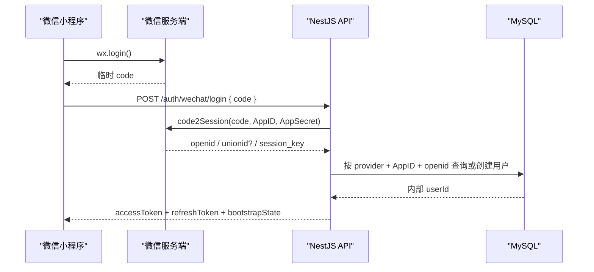

# 阶段一 API 接口清单

## 1. API 总则

| 项目 | 约定 |
| --- | --- |
| 协议 | HTTPS + JSON |
| 风格 | REST |
| 基础路径 | `/api/v1` |
| 接口描述 | NestJS Swagger 生成 OpenAPI 3 文档 |
| 鉴权 | 短期 access token + 可轮换 refresh token |
| access token 有效期 | 15 分钟 |
| refresh token 有效期 | 30 天 |
| 时间格式 | ISO 8601，服务端统一返回 UTC |
| 分页 | 基于游标，不使用页码 |
| 请求追踪 | 客户端可传 `X-Request-Id`，服务端保证响应始终包含 `requestId` |

### 1.1 成功响应

```json
{
  "data": {},
  "meta": {
    "nextCursor": null,
    "hasMore": false
  },
  "requestId": "01J4M3..."
}
```

没有分页时省略 `meta`。

### 1.2 失败响应

```json
{
  "code": "RECORD_VERSION_CONFLICT",
  "message": "记录已被其他成员修改，请刷新后重试",
  "details": {
    "currentVersion": 3
  },
  "requestId": "01J4M3..."
}
```

- `message` 用于直接展示给用户，但客户端业务判断只依赖稳定的 `code`。
- 生产环境不返回堆栈、SQL、OpenID、AppSecret 或对象存储签名参数。

## 2. 登录与身份链路



关键规则：

- 临时 `code` 只能使用一次，不可作为账号标识。
- 后端用 `AppID + OpenID` 定位身份，再映射到内部 `userId`。
- OpenID、UnionID 和 `session_key` 均不返回前端。
- 微信昵称和头像只是展示资料，不作为身份凭据。
- Access Token 必须包含内部 `userId` 和设备会话 `sid`，不得包含 OpenID。
- 处理受保护请求时除校验 JWT 签名和有效期外，还要确认 `sid` 对应会话未撤销且未过期；退出登录或复用检测后，旧 Access Token 不得继续访问业务接口。
- refresh token 由不透明 `tokenId + 随机 Secret` 组成；服务端只保存 Secret 的 HMAC，并在每次刷新后创建下一枚 Token。
- 会话绝对有效期为登录后 30 天，轮换不延长会话有效期；到期后重新执行微信登录即可恢复账号。

## 3. 接口总览

优先级说明：

- `P0`：阶段一上线必需。
- `P1`：阶段一运维或体验增强，可在 P0 主链路完成后补充。

### 3.1 系统接口

| 方法 | 路径 | 鉴权 | 优先级 | 用途 |
| --- | --- | --- | --- | --- |
| `GET` | `/health/live` | 否 | P0 | 进程存活检查 |
| `GET` | `/health/ready` | 部署平台/内网限制 | P0 | 数据库等依赖就绪检查 |

### 3.2 认证与当前用户

| 方法 | 路径 | 鉴权 | 优先级 | 用途 |
| --- | --- | --- | --- | --- |
| `POST` | `/auth/wechat/login` | 否 | P0 | 微信 code 登录或注册 |
| `POST` | `/auth/refresh` | refresh token | P0 | 轮换令牌 |
| `POST` | `/auth/logout` | access token | P0 | 撤销当前会话 |
| `GET` | `/me` | access token | P0 | 获取当前内部用户资料 |
| `PATCH` | `/me` | access token | P1 | 修改应用内昵称、头像 |

### 3.3 启动与首次初始化

| 方法 | 路径 | 鉴权 | 优先级 | 用途 |
| --- | --- | --- | --- | --- |
| `GET` | `/bootstrap` | access token | P0 | 获取启动上下文和下一步动作 |
| `POST` | `/onboarding` | access token | P0 | 原子创建家庭、管理员成员和宝宝 |

### 3.4 家庭与宝宝

| 方法 | 路径 | 鉴权 | 优先级 | 权限 | 用途 |
| --- | --- | --- | --- | --- | --- |
| `GET` | `/families` | access token | P0 | 当前用户 | 获取加入的家庭 |
| `GET` | `/families/:familyId/context` | access token | P0 | 活跃成员 | 获取家庭、宝宝及当前角色 |
| `GET` | `/families/:familyId` | access token | P0 | 活跃成员 | 获取家庭详情 |
| `PATCH` | `/families/:familyId` | access token | P1 | `ADMIN` | 修改家庭名称 |
| `GET` | `/babies/:babyId` | access token | P0 | 活跃成员 | 获取宝宝档案 |
| `PATCH` | `/babies/:babyId` | access token | P0 | `ADMIN`、`PARENT` | 编辑宝宝档案 |

> 家庭邀请、加入审批和成员管理属于阶段二，本清单不提供对应写接口。

### 3.5 成长记录

| 方法 | 路径 | 鉴权 | 优先级 | 权限 | 用途 |
| --- | --- | --- | --- | --- | --- |
| `GET` | `/babies/:babyId/records` | access token | P0 | 活跃成员 | 游标分页获取时间线 |
| `POST` | `/babies/:babyId/records` | access token | P0 | 活跃成员 | 创建文字/图片成长记录 |
| `GET` | `/records/:recordId` | access token | P0 | 活跃成员 | 获取记录详情 |
| `PATCH` | `/records/:recordId` | access token | P0 | 见权限矩阵 | 编辑记录 |
| `DELETE` | `/records/:recordId` | access token | P0 | 见权限矩阵 | 软删除记录 |

### 3.6 图片资源

| 方法 | 路径 | 鉴权 | 优先级 | 权限 | 用途 |
| --- | --- | --- | --- | --- | --- |
| `POST` | `/media/upload-intents` | access token | P0 | 活跃成员 | 创建图片直传凭证和资源记录 |
| `POST` | `/media/:assetId/complete` | access token | P0 | 上传者 | 确认上传并校验对象内容 |
| `POST` | `/media/access-urls` | access token | P0 | 活跃成员 | 批量获取短期图片访问地址 |
| `DELETE` | `/media/:assetId` | access token | P0 | 上传者或 `ADMIN` | 清理尚未绑定的图片 |

## 4. 核心接口定义

### 4.1 `POST /auth/wechat/login`

请求：

```json
{
  "code": "wx.login 返回的临时 code",
  "deviceId": "客户端生成并持久化的匿名设备 ID"
}
```

响应：

```json
{
  "data": {
    "accessToken": "eyJ...",
    "accessTokenExpiresIn": 900,
    "refreshToken": "opaque-random-token",
    "refreshTokenExpiresIn": 2592000,
    "user": {
      "id": "01J4M3...",
      "nickname": null,
      "avatarUrl": null
    },
    "nextAction": "ONBOARDING"
  },
  "requestId": "01J4M3..."
}
```

`nextAction` 枚举：

- `ONBOARDING`：用户尚无家庭，跳转首次初始化页。
- `ENTER_APP`：已有可用家庭，进入成长时间线。
- `UNAVAILABLE`：曾加入家庭但已被移除、没有可用宝宝，或阶段一检测到多个上下文无法安全选择；客户端展示不可用页。

`LOGIN` 是客户端在没有有效 Token 或刷新失败时使用的本地状态，不属于服务端 `nextAction`。

### 4.2 `POST /auth/refresh`

请求：

```json
{
  "refreshToken": "opaque-random-token"
}
```

成功后同时返回新的 Access Token 和 Refresh Token，`refreshTokenExpiresIn` 返回当前会话绝对过期时间的剩余秒数，不重置为 30 天。

轮换规则：

- 服务端先按 Refresh Token 中的 `tokenId` 查找令牌，再使用恒定时间比较校验随机 Secret 的 HMAC。
- 当前 Token 为 `ACTIVE` 时，在一个数据库事务中将其改为 `ROTATED`、创建下一枚 `ACTIVE` Token 并建立替换关系；并发刷新只有一个请求能成功。
- Secret 不匹配或 `tokenId` 完全未知时返回 `401 AUTH_TOKEN_INVALID`，不得撤销任何其他会话。
- 已正确通过 Secret 校验但状态为 `ROTATED` 时，说明旧 Token 被复用：撤销整个 `sid` 会话，返回 `401 AUTH_REFRESH_REUSED`，客户端重新执行微信登录。

### 4.3 `POST /auth/logout`

Access Token 中的 `sid` 标识当前设备会话。退出登录只撤销该 `sid` 及其全部 Refresh Token，成功返回 `204 No Content`；客户端无论接口是否成功都应清理本地 Token。

### 4.4 `GET /bootstrap`

用于小程序冷启动、登录恢复和前后台切换后的上下文恢复。

响应：

```json
{
  "data": {
    "user": {
      "id": "01J4M3...",
      "nickname": "舅舅",
      "avatarUrl": null
    },
    "families": [
      {
        "id": "01J4F...",
        "name": "宝宝的小家",
        "role": "ADMIN",
        "status": "ACTIVE"
      }
    ],
    "currentContext": {
      "familyId": "01J4F...",
      "babyId": "01J4B..."
    },
    "nextAction": "ENTER_APP"
  },
  "requestId": "01J4M3..."
}
```

阶段一要求正常业务数据中只有一个可用家庭和一个可用宝宝；数组结构仅为后续扩展预留。如果服务端检测到多个可用家庭，不猜测“最近家庭”，返回 `nextAction = UNAVAILABLE`、`currentContext = null` 并记录数据异常，家庭选择流程在阶段二实现。

### 4.5 `POST /onboarding`

请求必须携带 `Idempotency-Key` 请求头，值为客户端生成的 UUID 或 ULID。

```json
{
  "family": {
    "name": "宝宝的小家"
  },
  "baby": {
    "nickname": "宝宝",
    "birthDate": "2026-07-30",
    "birthTime": "08:26:00",
    "timezone": "Asia/Shanghai",
    "gender": "UNSPECIFIED"
  }
}
```

响应 `201 Created`，返回完整的家庭上下文。事务开始后必须先锁定当前用户行，再检查初始化状态；家庭、`ADMIN` 成员关系和宝宝必须在同一数据库事务中创建。

幂等规则：

- 同一用户、同一 `Idempotency-Key`、同一请求内容：返回第一次成功结果。
- 同一键但请求内容不同：返回 `409 IDEMPOTENCY_CONFLICT`。
- 用户已经完成初始化但换键重试：返回 `409 ONBOARDING_ALREADY_COMPLETED`，并在 `details` 中返回现有上下文 ID。
- 同一用户使用不同幂等键并发请求时，通过用户行锁串行检查初始化状态，只允许第一个事务创建成功。

### 4.6 `PATCH /babies/:babyId`

```json
{
  "nickname": "宝宝",
  "birthDate": "2026-07-30",
  "birthTime": "08:26:00",
  "timezone": "Asia/Shanghai",
  "gender": "FEMALE",
  "introduction": "欢迎来到这个世界",
  "version": 2
}
```

- 按 `PATCH` 语义提交需要修改的字段；省略字段表示不修改，显式传 `null` 只允许用于接口声明可清空的可选字段。
- `birthTime` 有值时按 `birthDate + birthTime + timezone` 得到准确出生时刻；为空时只按宝宝时区下的本地日期校验，出生当天任意时间均合法。
- 若修改出生日期/时间后会让已有记录早于上述出生日期/时刻，返回 `409 BABY_BIRTH_TIME_CONFLICT`。
- `version` 不匹配时返回 `409 BABY_VERSION_CONFLICT`。

### 4.7 `GET /babies/:babyId/records`

查询参数：

| 参数 | 类型 | 默认值 | 说明 |
| --- | --- | --- | --- |
| `cursor` | string | 无 | 上一页返回的不透明游标 |
| `limit` | number | 20 | 范围 1～50 |
| `month` | string | 无 | 可选，宝宝时区下的 `YYYY-MM` |
| `type` | string | 无 | 可选：`DAILY`、`FIRST`、`FAMILY`、`OTHER` |

排序固定为 `occurredAt DESC, id DESC`。游标内部包含上一条的 `occurredAt + id`，经签名或服务端编码后返回；客户端不得解析或拼接。

响应：

```json
{
  "data": [
    {
      "id": "01J4R...",
      "type": "DAILY",
      "content": "出生第七天，第一次晒太阳",
      "occurredAt": "2026-08-06T01:15:00.000Z",
      "creator": {
        "id": "01J4U...",
        "nickname": "舅舅",
        "avatarUrl": null
      },
      "assets": [
        {
          "id": "01J4A...",
          "category": "IMAGE",
          "width": 1440,
          "height": 1920,
          "accessUrl": "https://temporary-signed-url"
        }
      ],
      "version": 1,
      "createdAt": "2026-08-06T01:20:00.000Z",
      "updatedAt": "2026-08-06T01:20:00.000Z",
      "permissions": {
        "canEdit": true,
        "canDelete": true
      }
    }
  ],
  "meta": {
    "nextCursor": "opaque-cursor",
    "hasMore": true
  },
  "requestId": "01J4M3..."
}
```

时间线可直接携带短期签名地址以减少首屏请求；单独的批量访问地址接口用于地址过期后的刷新。

### 4.8 `POST /media/upload-intents`

小程序选择图片后，先申请直传凭证。

```json
{
  "babyId": "01J4B...",
  "category": "IMAGE",
  "fileName": "IMG_20260806.jpg",
  "mimeType": "image/jpeg",
  "sizeBytes": 1832048,
  "sha256": null
}
```

响应：

```json
{
  "data": {
    "assetId": "01J4A...",
    "upload": {
      "protocol": "MULTIPART_FORM_DATA",
      "method": "POST",
      "url": "https://temporary-upload-url",
      "name": "file",
      "header": {},
      "formData": {
        "key": "opaque-object-key",
        "policy": "opaque-policy",
        "signature": "opaque-signature"
      },
      "expiresAt": "2026-08-06T02:00:00.000Z"
    }
  },
  "requestId": "01J4M3..."
}
```

服务端要求：

- `mimeType` 和 `sizeBytes` 描述客户端压缩后的待上传文件；服务端先做声明值校验，阶段一只接受 JPEG、PNG、WebP，单图不超过 10 MB。
- 服务端生成 `objectKey`，客户端不能指定存储路径。
- 返回适配 `uni.uploadFile` 的签名表单 `POST` 参数；`formData` 由对象存储适配器生成并作为不透明字段传给客户端，客户端不得解析、修改或自行拼接签名。
- 凭证只能上传一个对象，短时有效；不得向客户端下发永久对象存储密钥。
- 资源初始状态为 `PENDING`。
- 上传域名和后续图片访问域名必须加入微信小程序合法域名配置；微信端使用 `UploadTask.onProgressUpdate` 展示单图进度。

### 4.9 `POST /media/:assetId/complete`

客户端直传成功后调用，请求体为空对象：

```json
{}
```

后端必须向对象存储读取对象并执行可信校验：确认路径和存在性、读取实际大小、检查文件头和实际 MIME、真实解码图片并获得宽高。客户端声明的 MIME、对象存储中由客户端写入的 `Content-Type` 和客户端宽高均不能作为唯一依据。校验失败时删除或隔离对象并返回稳定错误码；全部成功后资源状态才变为 `READY`。

该接口必须幂等：资源已经由同一上传者成功确认且状态为 `READY` 时，重复调用返回当前资源信息，不重复处理或创建资源。

### 4.10 `POST /babies/:babyId/records`

请求必须携带 `Idempotency-Key`，同时保存为记录的 `clientRequestId`。

```json
{
  "type": "DAILY",
  "content": "出生第七天，第一次晒太阳",
  "occurredAt": "2026-08-06T01:15:00.000Z",
  "assetIds": [
    "01J4A..."
  ]
}
```

校验规则：

- `type` 必须是 `DAILY`、`FIRST`、`FAMILY`、`OTHER` 之一。
- `content` 去除首尾空白后最多 1000 个字符。
- `content` 和 `assetIds` 至少有一项非空。
- 阶段一每条记录最多 9 张图片，且全部为 `READY`。
- 创建时图片必须属于当前家庭、当前宝宝和当前上传者，且尚未绑定其他记录。
- 宝宝填写了出生时间时，`occurredAt` 不得早于准确出生时刻；所有记录均不得超过服务端当前时间 5 分钟以上。
- 宝宝没有填写出生时间时，“不得早于出生”只比较宝宝时区下的本地日期，出生当天任意时间均合法。

成功返回 `201 Created` 和完整记录详情。相同幂等键重试不得重复生成记录。

### 4.11 `PATCH /records/:recordId`

```json
{
  "content": "出生第七天，晒了十分钟太阳",
  "occurredAt": "2026-08-06T01:15:00.000Z",
  "assetIds": [
    "01J4A...",
    "01J4A2..."
  ],
  "version": 1
}
```

- `assetIds` 表示编辑后的完整有序集合，不是增量操作。
- 更新成功后 `version` 加一。
- 版本冲突返回 `409 RECORD_VERSION_CONFLICT`，客户端提示刷新，不自动覆盖别人的修改。

### 4.12 `DELETE /records/:recordId`

通过查询参数携带版本：`DELETE /records/:recordId?version=2`。

成功返回 `204 No Content`。数据库执行软删除并保留记录与图片关联，关联图片保持 `READY` 且不进入孤儿资源清理任务；时间线和媒体访问接口均不得返回仅属于已删除记录的内容。阶段一不提供用户可见的恢复入口。删除请求不使用 body，避免小程序请求库和网关对 DELETE body 的兼容性差异。

### 4.13 `POST /media/access-urls`

```json
{
  "assetIds": [
    "01J4A...",
    "01J4A2..."
  ]
}
```

- 一次最多 50 个 ID。
- 服务端逐个核验当前用户对资源所属家庭的访问权。
- 资源必须关联至少一条当前 `PUBLISHED` 记录；只关联已删除记录的图片不可签发访问地址。
- 不存在或无权限的资源统一不返回具体归属信息，可整体返回 `404 ASSET_NOT_FOUND`，避免通过 ID 探测资源。
- 签名地址建议 5～15 分钟有效，客户端只做内存级缓存。

### 4.14 `DELETE /media/:assetId`

用于用户从草稿中移除已经申请上传凭证的图片。资源为当前用户上传或当前用户是家庭 `ADMIN`，且尚未绑定任何成长记录时，将资源标记为 `ORPHANED` 并返回 `204 No Content`。

- 删除操作幂等；资源已经是 `ORPHANED` 或 `DELETED` 时仍返回 `204`。
- 资源已经绑定任意记录时返回 `409 ASSET_IN_USE`，不能通过媒体接口绕过成长记录的编辑和删除规则。
- 后台任务将创建超过 24 小时、仍为 `READY` 且未绑定记录的资源转为 `ORPHANED`，处理客户端未成功发送删除请求的情况。

## 5. 权限矩阵

### 5.1 角色能力

| 操作 | `ADMIN` | `PARENT` | `RELATIVE` |
| --- | --- | --- | --- |
| 查看家庭、宝宝、时间线 | 是 | 是 | 是 |
| 创建成长记录 | 是 | 是 | 是 |
| 编辑自己的成长记录 | 是 | 是 | 是 |
| 编辑他人的成长记录 | 是 | 是 | 否 |
| 删除自己的成长记录 | 是 | 是 | 是 |
| 删除他人的成长记录 | 是 | 否 | 否 |
| 编辑宝宝档案 | 是 | 是 | 否 |
| 修改家庭名称 | 是 | 否 | 否 |

服务端必须执行权限判断；前端的按钮隐藏和 `permissions.canEdit/canDelete` 只是体验优化。

### 5.2 资源归属校验

对于只包含 `recordId` 或 `assetId` 的 URL，服务端必须：

1. 从 token 获得内部 `userId`。
2. 在查询中同时关联目标实体和当前用户的 `ACTIVE family_member`，把 `familyId` 作为数据访问范围，而不是先加载任意家庭数据再补做校验。
3. 查询不到可访问实体时统一返回资源对应的 `404`。
4. 查询成功后，再根据角色、创建人或上传人判断具体操作权限；权限不足返回 `403`。

错误响应不得泄露“资源存在但属于另一个家庭”。

## 6. 错误码

| HTTP | 错误码 | 场景 |
| --- | --- | --- |
| 400 | `VALIDATION_ERROR` | DTO 字段、格式或长度不合法 |
| 400 | `AUTH_INVALID_WECHAT_CODE` | 微信 code 无效、过期或已使用 |
| 401 | `AUTH_TOKEN_EXPIRED` | access token 过期 |
| 401 | `AUTH_TOKEN_INVALID` | token 签名或会话无效 |
| 401 | `AUTH_REFRESH_REUSED` | 已轮换的 refresh token 被再次使用 |
| 403 | `FAMILY_FORBIDDEN` | 已确认资源属于当前用户的活跃家庭，但当前角色不允许该操作 |
| 404 | `FAMILY_NOT_FOUND` | 家庭不存在，或当前用户不是该家庭的活跃成员 |
| 404 | `BABY_NOT_FOUND` | 宝宝不存在，或不属于当前用户可访问的家庭 |
| 404 | `RECORD_NOT_FOUND` | 记录不存在、已删除，或不属于当前用户可访问的家庭 |
| 404 | `ASSET_NOT_FOUND` | 资源不存在、不可发布访问，或不属于当前用户可访问的家庭 |
| 409 | `ONBOARDING_ALREADY_COMPLETED` | 用户已完成初始化 |
| 409 | `IDEMPOTENCY_CONFLICT` | 同一幂等键对应不同请求内容 |
| 409 | `BABY_BIRTH_TIME_CONFLICT` | 新出生时间晚于已有记录 |
| 409 | `BABY_VERSION_CONFLICT` | 宝宝档案版本过期 |
| 409 | `RECORD_VERSION_CONFLICT` | 成长记录版本过期 |
| 409 | `ASSET_ALREADY_ATTACHED` | 图片已被其他记录绑定 |
| 409 | `ASSET_IN_USE` | 尝试直接删除已被记录引用的图片 |
| 422 | `RECORD_TIME_BEFORE_BIRTH` | 记录时间早于出生时刻 |
| 422 | `RECORD_TIME_IN_FUTURE` | 记录时间明显晚于当前时间 |
| 422 | `RECORD_EMPTY` | 文字和图片均为空 |
| 422 | `ASSET_NOT_READY` | 图片尚未完成上传确认 |
| 422 | `ASSET_TYPE_NOT_ALLOWED` | 文件类型不在允许列表 |
| 422 | `ASSET_CONTENT_INVALID` | 文件头、实际 MIME 或图片解码校验失败 |
| 422 | `ASSET_SIZE_EXCEEDED` | 文件超过大小限制 |
| 429 | `RATE_LIMITED` | 请求频率超限 |
| 500 | `INTERNAL_ERROR` | 未预期服务端错误 |

错误选择规则：针对带资源 ID 的请求，资源不存在与跨家庭不可见统一返回 `404`；只有已经确认资源属于当前用户的活跃家庭、但角色或所有权不足时才返回 `403`。错误消息和 `details` 不得暴露跨家庭资源是否真实存在。

## 7. 幂等、并发与重试

### 7.1 幂等接口

以下写接口要求 `Idempotency-Key`：

- `POST /onboarding`
- `POST /babies/:babyId/records`

服务端以“用户 + 接口作用域 + 幂等键”保存处理结果或通过业务唯一键保证幂等。请求体需要计算规范化摘要；相同键但摘要不同必须报冲突。

幂等表只保存可安全重放的业务字段，不保存 Token 或短期签名 URL。重放成长记录响应时，应按保存的资源 ID 重新生成当前有效的访问地址。

Onboarding 还必须在事务中锁定用户行。幂等键负责相同请求的安全重放，用户行锁负责阻止同一用户携带不同幂等键并发创建两个家庭。

### 7.2 可安全重试

- 网络错误时，客户端可用相同幂等键重试初始化和创建记录。
- 申请上传凭证失败可重新申请；已经拿到 `assetId` 后优先重试幂等的完成确认，避免重复上传。
- `PATCH` 不自动重试，必须先刷新最新版本。

### 7.3 乐观锁

`babies` 和 `growth_records` 的更新、删除均要求 `version`。服务端更新条件包含当前版本，受影响行数为 0 即返回 `409`。

## 8. 限流与输入边界

阶段一初始建议值：

| 接口 | 限制 |
| --- | --- |
| 微信登录 | 每 IP + deviceId 每分钟 20 次 |
| refresh | 每会话每分钟 10 次 |
| 创建上传凭证 | 每用户每分钟 30 次 |
| 创建成长记录 | 每用户每分钟 60 次 |
| 获取图片访问地址 | 每用户每分钟 60 次，每次最多 50 个资源 |
| 时间线 | `limit` 最大 50 |
| JSON 请求体 | 最大 1 MB；图片必须直传对象存储 |

具体值通过配置管理，不硬编码在控制器中。

## 9. NestJS 模块拆分

```text
AppModule
├── AuthModule          微信登录、JWT、会话轮换
├── UsersModule         当前用户资料
├── BootstrapModule     启动上下文
├── OnboardingModule    首次初始化事务
├── FamiliesModule      家庭与成员权限
├── BabiesModule        宝宝档案
├── RecordsModule       成长记录与时间线
├── MediaModule         直传凭证、资源确认、签名读取
├── AuditModule         脱敏审计事件
├── PrismaModule        数据访问与事务
└── HealthModule        存活/就绪检查
```

工程约束：

- Controller 只负责协议适配和 DTO 校验，业务规则进入 Service/Domain 层。
- 家庭成员检查封装成 Guard 或策略服务，但不能只做角色检查而忽略实体 `familyId`。
- 微信和对象存储 SDK 封装在基础设施适配器中，便于本地测试和未来迁移平台。
- DTO 使用 `class-validator` 或等价方案；数据库 Model 不直接作为响应 DTO。
- 全局异常过滤器统一输出错误结构；日志中间件统一生成 `requestId`。

## 10. OpenAPI 与测试验收

每个 P0 接口必须在 OpenAPI 中包含请求 DTO、响应 DTO、错误码和鉴权声明。最低测试范围：

- Auth：新用户登录、老用户登录、无效 code、refresh 轮换和复用检测。
- Auth 并发：两个请求同时刷新同一枚 Token 时只有一个成功；复用旧 Token 撤销所属会话，但随机无效 Token 不得撤销其他会话。
- Onboarding：成功事务、重复点击幂等、不同幂等键并发初始化、事务失败回滚。
- Permission：三种角色分别访问自己、他人、跨家庭资源。
- Record：纯文字、纯图片、图文、历史补录、空记录、出生前记录、未来记录。
- Media：非法声明 MIME、实际文件头不匹配、图片解码失败、超限文件、伪造完成、完成确认幂等、跨家庭绑定、重复绑定、未绑定资源清理、已删除记录图片不可签名访问。
- Concurrency：宝宝档案和记录的版本冲突。
- Pagination：同一时间多条记录、连续翻页无重复无遗漏。

阶段一接口验收标准：Swagger 可调用全部 P0 接口，主链路集成测试通过，跨家庭越权测试必须为零容忍。

## 11. 明确不在阶段一的接口

以下接口暂不设计或开放，避免范围膨胀：

- 家庭邀请码、扫码加入、成员审批和移除。
- 里程碑模板与里程碑记录。
- 语音上传、转码和播放。
- 用户可见的回收站与恢复接口。
- 数据导出和迁移。
- AI 总结、问答、向量检索及模型调用。
- 手机号绑定与短信登录。
